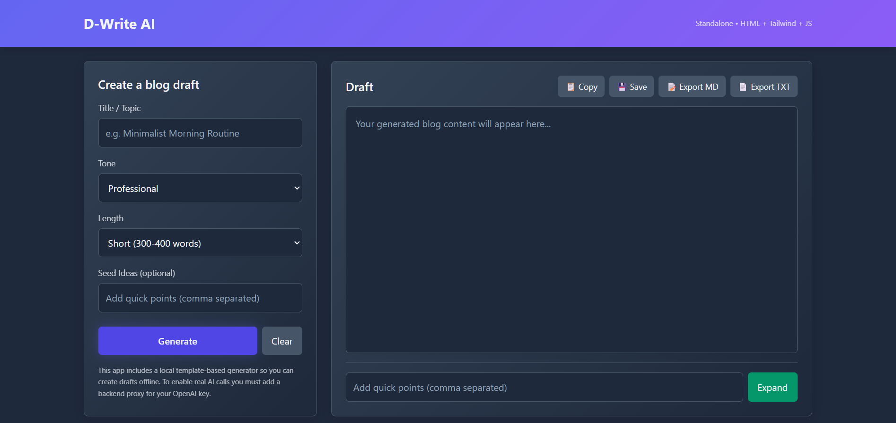
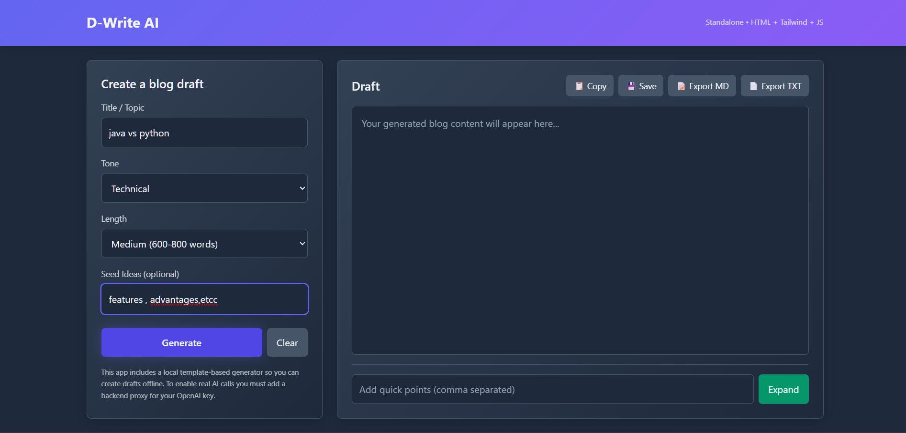

# D-Write-AI ✍️🤖

D-Write-AI is an **AI-powered writing assistant** designed for students, professionals, and creators who want to write smarter, faster, and better.  
It helps you **generate ideas, correct grammar, refine tone, and restructure text** with ease.

---

## 🔗 Live Demo

👉 [View Live Demo](https://dharsh606.github.io/D-write-AI/)  

---

## 📸 Screenshots

### 🏠 Homepage


### ✍️ Writing Assistant in Action



> 📌 Save your screenshots in a folder called `screenshots` inside the repo, and update the file paths above.

---

## ✨ Features

- ✅ Grammar & Spell Check  
- ✅ Tone & Style Suggestions (formal, casual, professional, etc.)  
- ✅ AI-generated content ideas  
- ✅ Simple, clean, and distraction-free UI  
- ✅ Works directly in the browser (no setup required)  

---

## 🚀 Getting Started

1. Clone the repository:
   ```bash
   git clone https://github.com/Dharsh606/D-write-AI.git
